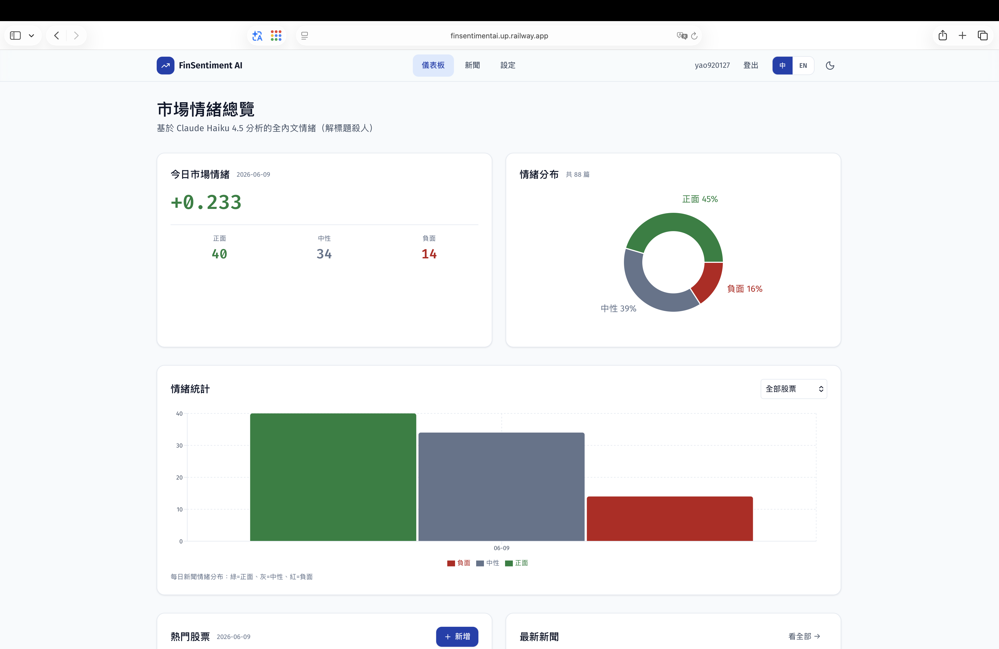
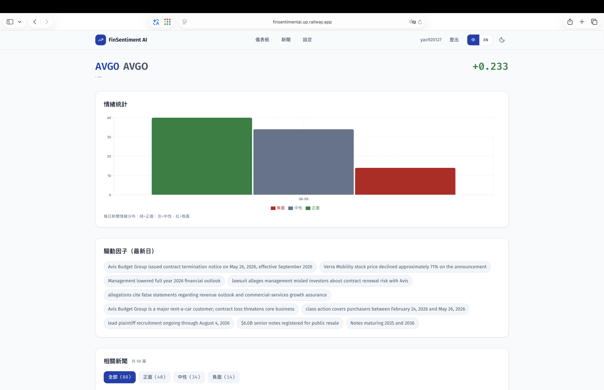
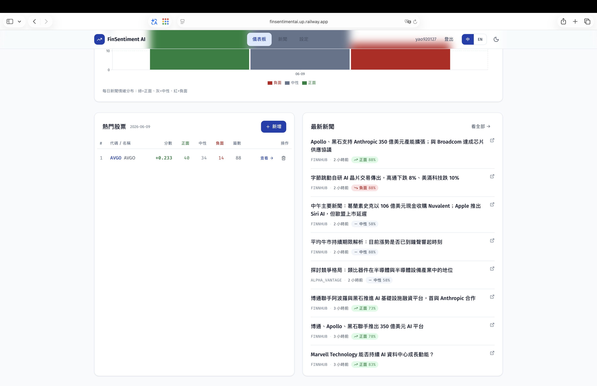
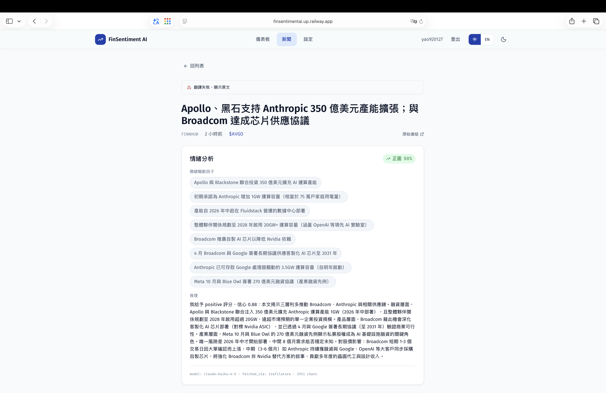
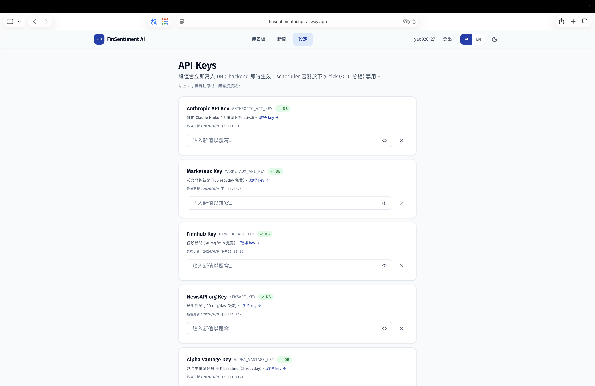

<div align="center">

# 📈 FinSentiment AI

**新聞驅動的金融情緒儀表板**

由 **Claude Haiku 4.5** 分析**完整新聞內文**（而非標題），破解財經報導的「標題殺人」。

**🌐 [English](README.en.md) · 繁體中文**

</div>

---

 

---

## 這是什麼

FinSentiment AI 是一個針對**美股 + 台股**的新聞情緒儀表板。核心產品理念是 **anti-clickbait（反標題殺人）**：情緒分數來自 **Claude Haiku 4.5** 對**整篇新聞內文**的雙語（繁中 + 英文）結構化分析，而不是只看標題。一顆 LLM 取代了原計劃的 FinBERT + 中文 RoBERTa 雙模型方案，免去扛 2.4GB torch 的負擔。

> 系統是 **完全多租戶 / per-user 隔離** 的：每位使用者有自己的觀察清單、自己的新聞與情緒資料、以及自己加密儲存的 API key。沒有任何背景排程器 — **所有分析都是 on-demand**，由使用者用自己的 key 主動觸發。

## 畫面

| 市場情緒總覽 | 個股趨勢 + 驅動因子 |
|---|---|
|  |  |
| **觀察清單 + 最新新聞** | **新聞情緒分析 + 完整內文** |
|  |  |

**Per-user 加密 API Key 設定頁** — 每位使用者自填、Fernet 加密儲存：



## 架構

```
┌──────────┐    /api    ┌─────────────┐  asyncpg  ┌──────────────┐
│ Frontend │───────────▶│   Backend   │──────────▶│  PostgreSQL  │
│ React 19 │  (nginx    │   FastAPI   │           │     16       │
│  Vite 8  │   proxy)   └──────┬──────┘           │ (per-user)   │
└──────────┘                   │                  └──────────────┘
                               │ 兩段式 on-demand 流程
              ┌────────────────┴─────────────────┐
              ▼                                   ▼
     ┌─────────────────┐                ┌───────────────────┐
     │  Pipeline       │   un-analyzed  │  Sentiment        │
     │  6 個 fetcher    │──── rows ─────▶│  Claude Haiku 4.5 │
     │  → 三層內文擷取   │                │  + prompt cache    │
     │  → 去重入庫       │                │  雙語結構化輸出      │
     └─────────────────┘                └───────────────────┘
```

**兩段式資料流**（刻意分離、不可合併）：

1. **Pipeline** — `run_for_ticker()` 並行扇出 6 個 fetcher（皆用使用者自己的 key），三層 fallback 內文擷取器把 URL 轉成完整 Markdown，依 `(stock_id, url_hash)` 去重入庫。
2. **Sentiment** — 對「尚未分析」的 rows 跑 Claude，輸出 9 欄位雙語結構化結果。

**兩個觸發點，同一套 pipeline + sentiment（無排程器）：**
- `POST /api/stocks/{symbol}/refresh` → 背景 `asyncio` task（`Semaphore(2)` 限流），寫入 `refresh_jobs`，前端輪詢進度。
- 手動 CLI：`uv run python -m scripts.run_pipeline <user_id> TSM`。

## 6 個資料來源（全 API 化，不寫傳統爬蟲）

| 類型 | 來源 | 用途 |
|---|---|---|
| 新聞 | Marketaux · Finnhub · NewsAPI · Alpha Vantage | 英文財經新聞；AV 自帶情緒分數可作 baseline 對照 |
| 社群 | PTT 股票版 · StockTwits | 散戶情緒；StockTwits 自帶 bullish/bearish 作 ground truth |
| 內文擷取 | Jina Reader → trafilatura → snippet | 三層 fallback，把新聞 URL 轉成完整內文（記錄勝出層於 `fetched_via`） |

## AI 設計亮點

- **Claude Haiku 4.5** 一顆模型搞定中英文，取代 FinBERT + 中文 RoBERTa 雙模型。
- **Prompt caching**：system prompt 刻意 **> 4096 tokens** 以達 Haiku 4.5 最低快取門檻，第 2 篇起 input 省 ~90% 成本。
- **雙語結構化輸出**：每篇回傳 9 個欄位 — `label` / `confidence` / `is_clickbait` / `title_zh` / `title_en` / `key_drivers_zh` / `key_drivers_en` / `reasoning_zh` / `reasoning_en`。
- **標題殺人偵測**：`is_clickbait` 自動標記 title 與 body 情緒矛盾的新聞。
- **實測成本**：112 篇 backfill ≈ **$0.40**。

## 多租戶與安全

- **Per-user 隔離是核心不變式**：`stocks`、`refresh_jobs` 帶 `user_id`；`news`/`comments`/`sentiment_results`/`market_summary` 經 `stock_id` FK 繼承隔離。`url_hash` 唯一性是 **per-stock**，同一篇公開文章可在兩位使用者底下各自獨立分析。
- **登入**：Google OAuth（`POST /api/auth/google`）換發 JWT；除 `/api/auth/*` 外所有路由皆需登入並 scope 到 `current_user`。
- **Per-user 加密 API key**：每位使用者在 `/settings` 自填 key，以 **Fernet 加密**（金鑰由 `SECRET_KEY` 衍生）存於 `app_settings`。**沒有 fallback 到營運者的環境變數** — 沒設 key 就無法抓該來源，誰也花不到別人的額度。

## 一鍵啟動

```bash
# 1. 設定環境變數（SECRET_KEY 請填長亂數；API key 由使用者登入後在 /settings 自填）
cp .env.example .env && $EDITOR .env

# 2. 起全棧（postgres + pgAdmin + backend + nginx frontend，無排程器容器）
docker compose up -d --build

# 3. 開瀏覽器，用 Google 登入後到「設定」填入自己的 API key
open http://localhost:5173
```

| 服務 | URL | 帳密 |
|---|---|---|
| 前端 (nginx + Vite SPA) | http://localhost:5173 | Google 登入 |
| 後端 (FastAPI + OpenAPI) | http://localhost:8000/docs | — |
| pgAdmin | http://localhost:5050 | admin@local.dev / admin |
| Postgres | localhost:**5433** | finsentiment / finsentiment_dev |

> Port **5433** 是刻意避開本機常見 PostgreSQL 5432 的衝突；容器內仍是 5432。

## 開發模式（不用 docker）

```bash
docker compose up -d postgres pgadmin                                  # Postgres 仍用容器
cd backend  && uv sync && uv run uvicorn main:app --reload --port 8000  # Backend 熱重載
cd frontend && bun install && bun run dev                              # Frontend 熱重載
```

## 手動 CLI（資料皆 per-user，需帶 user_id）

```bash
cd backend
uv run python -m scripts.run_pipeline <user_id> TSM   # 抓取 + 擷取 + 入庫
uv run python -m scripts.backfill_sentiment           # 對未分析 rows 跑 Claude
uv run python -m scripts.run_daily_summary            # 重算今日 market_summary
```

## API Endpoints

除 `/api/auth/*` 外所有路由皆需登入，並 scope 到 `current_user`。

| Method | Path | 說明 |
|---|---|---|
| POST | `/api/auth/google` | Google OAuth → JWT |
| GET | `/api/users/me` | 當前使用者（需 Bearer token） |
| GET | `/api/stocks` | 使用者的觀察清單 |
| POST | `/api/stocks` | 新增股票到觀察清單 |
| DELETE | `/api/stocks/{symbol}` | 移除股票 |
| GET | `/api/stocks/{symbol}?days=N` | 個股趨勢 + 驅動因子 |
| GET | `/api/stocks/{symbol}/impact` | 個股逐篇影響拆解 |
| POST | `/api/stocks/{symbol}/refresh` | 觸發 on-demand 更新任務（202） |
| GET | `/api/market/today` | 今日 + 昨日 + change |
| GET | `/api/market/history?days=N` | 時間序列 |
| GET | `/api/market/trending?limit=N` | 排行榜 |
| GET | `/api/news?q=&symbol=&limit=N` | 新聞列表 + 情緒 snippet |
| GET | `/api/news/{id}` | 完整內文 + analysis metadata |
| GET | `/api/news/{id}/translation/{lang}` | 即時翻譯 |
| GET / PUT / DELETE | `/api/admin/settings/{key}` | 管理 per-user 加密 API key |
| GET | `/api/refresh-jobs/{id}` | 輪詢更新任務 |
| GET | `/api/refresh-jobs` | 列出近期更新任務 |

## 測試

```bash
cd backend  && uv run pytest                                   # 40 tests
cd frontend && bunx tsc --noEmit -p tsconfig.app.json          # 型別檢查
cd frontend && bun run lint                                    # ESLint
```

## 技術棧

| 層 | 工具 |
|---|---|
| 前端 | React 19 · Vite 8 · TypeScript 6 · Tailwind 3 · Recharts · React Router 7 · TanStack Query 5 · i18next（中/英） · Google OAuth · Zod · lucide-react |
| 後端 | FastAPI · SQLAlchemy 2.0 (async) · Alembic · Pydantic v2 · asyncpg · httpx · tenacity · loguru · trafilatura · passlib · python-jose |
| AI | Anthropic SDK + Claude Haiku 4.5（結構化輸出 + prompt caching） |
| 資料庫 | PostgreSQL 16 |
| Container | Docker Compose（postgres + pgAdmin + backend + frontend nginx） |
| 部署 | Railway |

## 慣例

- Python 3.12，`uv` 管環境與依賴（`uv sync`、`uv run …`），不要直接用 pip。
- Ruff target `py312`，line length 100。
- DB 全部用 async SQLAlchemy 2.0（`AsyncSession`）— 不要在 async 路徑中阻塞於 sync session。
- 日誌用 `loguru` 並用大括號佔位：`logger.info("msg {}", value)`。
- 前端 server state 一律用 React Query；JWT 存於 `localStorage` 的 `finsentiment.token`，由 axios interceptor 附帶。
- Sentiment system prompt 刻意 **> 4096 tokens** — 不要降到 Haiku 4.5 快取門檻以下。
