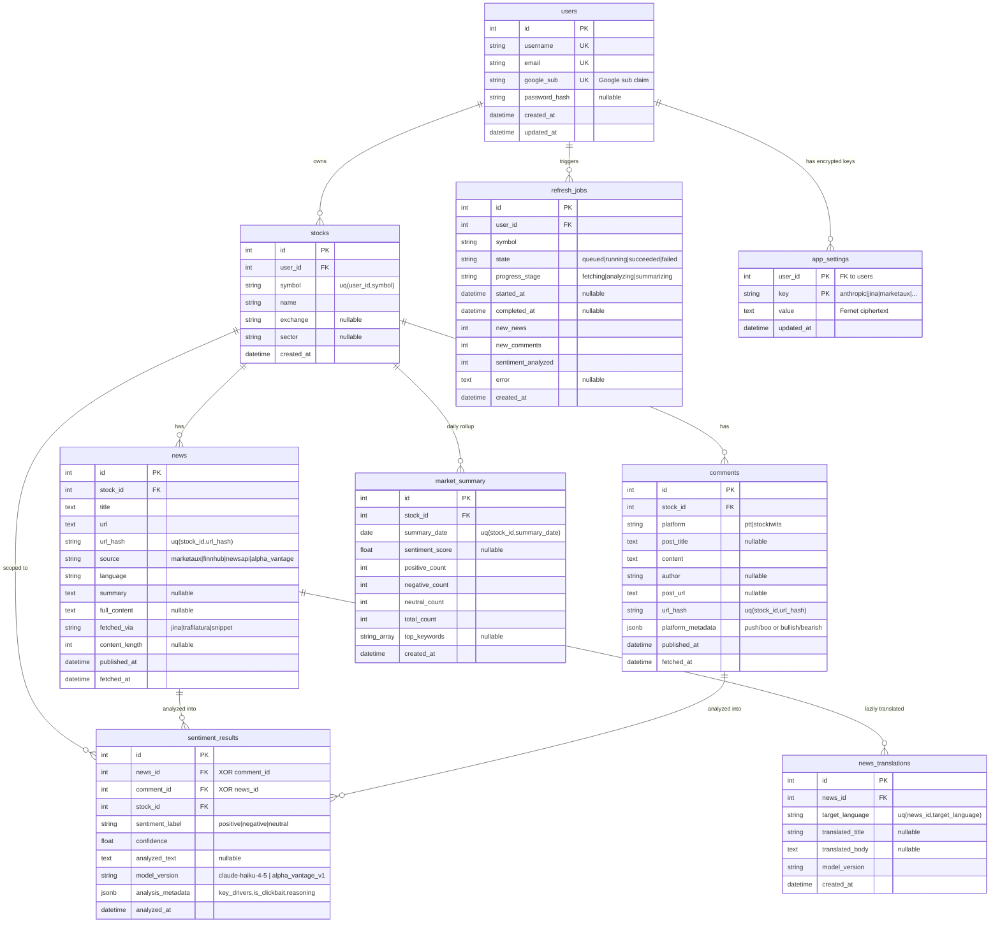
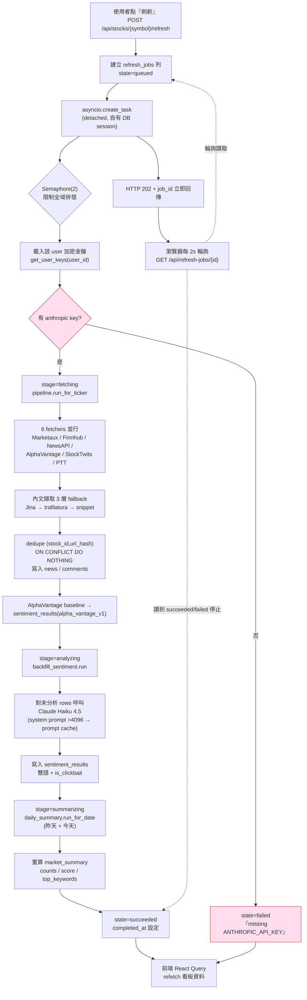
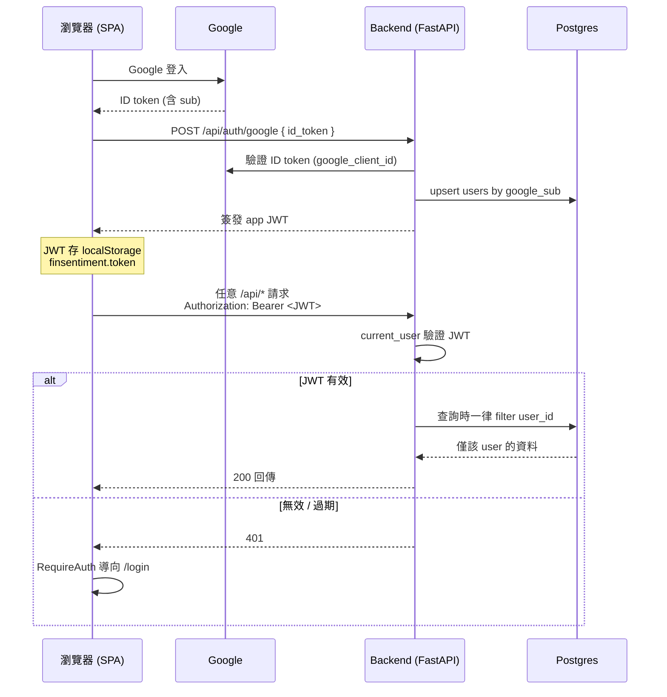
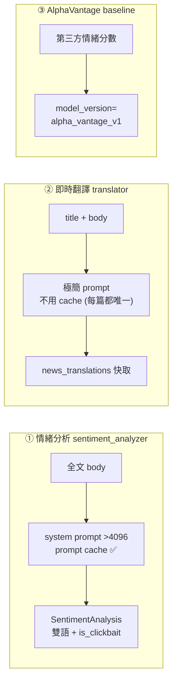

# FinSentiment AI — ER 圖與流程圖

> 圖以 Mermaid 撰寫，GitHub、VS Code（Markdown Preview Mermaid）、Obsidian 皆可直接渲染。

---

## 1. ER 圖（資料模型）

多租戶核心不變量：所有資料都掛在 `users` 之下。`stocks` 與 `refresh_jobs` 直接帶 `user_id`；
`news` / `comments` / `sentiment_results` / `market_summary` 透過 `stock_id` 繼承隔離。

**模型重點**
- `sentiment_results` 有 `CheckConstraint`：`news_id` 與 `comment_id` 二擇一（XOR）。
- `app_settings` 用複合主鍵 `(user_id, key)`，`value` 以 Fernet 加密（金鑰由 `SECRET_KEY` 推導）。
- `url_hash` 唯一性是「每 stock」而非全域 → 同一篇公開文章可在兩位使用者底下各存一份、各自分析。
- 無 operator fallback 金鑰：使用者沒設某來源的 key 就不抓該來源。

---

## 2. 流程圖 — On-demand Refresh（核心非同步管線）

`POST /api/stocks/{symbol}/refresh` 立即回 202，工作交給 detached task；瀏覽器每 2 秒輪詢 job 狀態。

**啟動時清理**：backend 啟動會把 `running` 超過 30 分鐘的 job 標為 `failed`（容器重啟殘留）。

---

## 3. 流程圖 — 認證 / 請求授權

---

## 4. 三處 LLM 用途（皆 Claude Haiku 4.5）

| 用途 | 觸發 | Prompt cache | 落地表 |
|------|------|-------------|--------|
| 情緒分析 | refresh / `backfill_sentiment` | ✅ (system >4096 token) | `sentiment_results` |
| 即時翻譯 | `GET /api/news/{id}/translation/{lang}` | ❌（刻意關閉） | `news_translations` |
| AV baseline | pipeline 抓 AlphaVantage 時 | — | `sentiment_results` |
